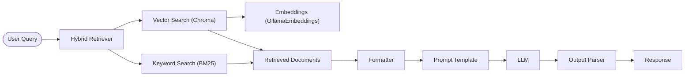

# Hybrid RAG Chatbot with Streamlit, LangChain, Chroma, and Ollama

[](https://opensource.org/licenses/MIT)

## Description

Welcome to the **Hybrid RAG Chatbot**, a powerful web-based application designed to answer questions based on the content of uploaded PDF documents. This project leverages a **Hybrid Retrieval-Augmented Generation (RAG)** approach, combining the strengths of vector-based semantic search and keyword-based search to deliver accurate and relevant responses. Built with cutting-edge technologies like **Streamlit**, **LangChain**, **Chroma**, and **Ollama**, this chatbot is ideal for researchers, students, or professionals who need to extract insights from documents efficiently.

The application features a user-friendly interface where you can upload PDFs, adjust settings, and interact with the chatbot in a conversational manner. Responses are generated in real-time, with citations to the source documents for transparency and verifiability.

## Features

| Feature | Description |
|---------|-------------|
| **PDF Upload & Processing** | Upload multiple PDF files, which are automatically split into chunks and indexed for querying. |
| **Conversational Interface** | Ask questions in a chat-like interface and receive detailed answers based on document content. |
| **Hybrid RAG Technique** | Combines vector search (Chroma) and keyword search (BM25) for enhanced retrieval accuracy. |
| **Adjustable Parameters** | Tune the **Temperature** (response creativity) and **Hybrid Search Ratio** (balance between vector and keyword search). |
| **Real-Time Responses** | Answers are streamed in real-time for a seamless user experience. |
| **Error Handling** | Robust error handling and fallback mechanisms ensure reliable operation. |
| **Source Citations** | Responses include references to the source documents, enhancing trust and verifiability. |

## Architecture

The application follows a modular architecture with clearly separated concerns, making it maintainable, testable, and extensible:

### Component Structure

```
Hybrid-RAG-chatbot-main/
├── main.py                 # Streamlit UI + application orchestrator
├── README.markdown         # This file
├── requirements.txt        # Dependencies
└── components/
    ├── chunking.py         # Document chunking logic
    ├── embeddings.py       # Embedding model management
    ├── llm.py              # Language model management
    ├── retriever.py        # Retriever creation (BM25, hybrid)
    ├── vector_store.py     # Vector store initialization/cleanup
    └── README.md           # Component documentation
```

### Component Responsibilities

1. **`chunking.py`** - Handles document segmentation
   - `chunk_documents()`: Splits documents into configurable chunks

2. **`embeddings.py`** - Manages embedding models
   - `get_embeddings_model()`: Initializes and caches Ollama embeddings

3. **`llm.py`** - Manages language models
   - `get_llm()`: Initializes and caches Ollama language models

4. **`retriever.py`** - Creates retrieval mechanisms
   - `create_bm25_retriever()`: BM25 keyword-based retriever
   - `create_hybrid_retriever()`: Combines BM25 and vector search

5. **`vector_store.py`** - Handles vector database operations
   - `initialize_vector_store()`: Sets up ChromaDB with documents
   - `get_vector_retriever()`: Gets retriever from vector store
   - `clear_vector_store()`: Cleans up vector store resources

6. **`main.py`** - Orchestrates the application
   - Streamlit UI components
   - Application workflow coordination
   - Session state management
   - Component integration

### Data Flow

1. **Input**: User uploads PDF files through Streamlit interface
2. **Processing**:
   - Files saved to `uploaded_pdfs/` directory
   - Documents loaded and split into chunks (chunking.py)
   - Chunks tagged with source metadata
3. **Indexing**:
   - Chunks embedded using Ollama embeddings (embeddings.py)
   - Stored in Chroma vector store (vector_store.py)
   - BM25 index created from chunks (retriever.py)
4. **Query Handling**:
   - User question processed through hybrid retriever (retriever.py)
   - Combines vector search (Chroma) and keyword search (BM25)
   - Configurable ratio balances both approaches
5. **Generation**:
   - Retrieved context formatted for LLM
   - Prompt constructed with question and context
   - Ollama LLM generates response (llm.py)
   - Response streamed back to user

## How It Works

The Hybrid RAG Chatbot uses a sophisticated pipeline to process documents and generate answers. Here’s a detailed look at the process:

### Document Processing
- **PDF Loading**: Uploaded PDFs are loaded using `PyPDFLoader` from LangChain.
- **Text Splitting**: Documents are split into manageable chunks (1000 characters, 200-character overlap) using `RecursiveCharacterTextSplitter`.
- **Metadata Tagging**: Each chunk is tagged with metadata, such as the source file name, for traceability.

### Retrieval
The chatbot employs a **Hybrid RAG** approach, integrating two retrieval methods:
- **Vector Search**: Documents are embedded into a high-dimensional vector space using `OllamaEmbeddings` (model: `nomic-embed-text:latest`) and stored in a Chroma vector store. This enables semantic similarity searches, retrieving the top 5 most relevant chunks (`k=5`).
- **Keyword Search**: A BM25 retriever ranks documents based on keyword matching, also retrieving the top 5 chunks (`k=5`).
- **Hybrid Search**: An `EnsembleRetriever` combines the results of both methods, with a configurable **Hybrid Search Ratio** (e.g., 0.5 for equal weighting, 0.7 for 70% vector search). If hybrid search fails, it falls back to vector search for robustness.

### Augmentation
- Retrieved document chunks are formatted into a context string, including the source file name and content, using a custom `format_docs` function.
- The context is combined with the user’s query in a `ChatPromptTemplate` to provide the language model with all necessary information.

### Generation
- The formatted context and query are passed to an `OllamaLLM` (model: `qwen2.5:latest`) to generate a detailed response.
- The response is parsed using `StrOutputParser` and streamed to the user interface in real-time using Streamlit’s `st.write_stream`.

### Diagram of the RAG Pipeline
The following diagram illustrates the flow of the Hybrid RAG pipeline:



This diagram can be rendered in GitHub to visualize the pipeline from query to response.

## Environment Setup

To run the Hybrid RAG Chatbot, you’ll need to set up the following:

- **Python 3.8 or later**: Ensure Python is installed on your system. Download from [python.org](https://www.python.org/downloads/).
- **Ollama**: A tool for running large language models locally. Install it based on your operating system:
  - **Windows**: Download the installer from [Ollama Download](https://ollama.com/download) and run it.
  - **macOS**: Download the installer from [Ollama Download](https://ollama.com/download), unzip it, and drag the `Ollama.app` to your Applications folder.
  - **Linux**: Run the installation script as per the [Ollama GitHub repository](https://github.com/ollama/ollama).
- **Python Libraries**: Install the required dependencies listed in `requirements.txt`.

## Installation

Follow these steps to set up the project:

1. **Clone the Repository**:
   ```bash
   git clone https://github.com/faizan616/Hybrid-RAG.git
   ```
2. **Navigate to the Project Directory**:
   ```bash
   cd Hybrid-RAG
   ```
3. **Install Dependencies**:
   ```bash
   pip install -r requirements.txt
   ```
   The `requirements.txt` file includes dependencies like `streamlit`, `langchain`, `chromadb`, `langchain-ollama`, and others.

## Usage

1. **Start Ollama**: Ensure the Ollama service is running on your system. Follow the instructions from the [Ollama GitHub repository](https://github.com/ollama/ollama) to start the service.
2. **Run the Streamlit App**:
   ```bash
   streamlit run main.py
   ```
   This will launch the app in your default web browser.
3. **Upload PDFs**:
   - In the sidebar, use the file uploader to select one or more PDF files.
   - The files are saved locally in the `uploaded_pdfs` directory and indexed in a Chroma database (`chroma_db`).
4. **Adjust Settings**:
   - Use the sliders in the sidebar to set the **Temperature** (0.0 to 1.0) and **Hybrid Search Ratio** (0.0 to 1.0).
   - Optionally, clear all documents to reset the application.
5. **Ask Questions**:
   - Enter your query in the chat input field in the main interface.
   - The chatbot will retrieve relevant document chunks, generate a response, and stream it in real-time.
   - Responses include citations to the source documents for reference.

## Configuration

The application allows you to fine-tune its behavior through two key parameters:

| Parameter | Description | Range |
|-----------|-------------|-------|
| **Temperature** | Controls the randomness of the LLM’s responses. Lower values (e.g., 0.0) produce more deterministic answers, while higher values (e.g., 1.0) increase creativity. | 0.0 to 1.0 |
| **Hybrid Search Ratio** | Balances the contribution of vector search (semantic) and keyword search (BM25). A value of 0.5 gives equal weight, while 0.7 prioritizes vector search. | 0.0 to 1.0 |

## Contributing

We welcome contributions to enhance the Hybrid RAG Chatbot! To contribute:
- Fork the repository.
- Make your changes in a new branch.
- Submit a pull request with a clear description of your changes.

For detailed guidelines, refer to the [CONTRIBUTING.md](CONTRIBUTING.md) file.

## License

This project is licensed under the MIT License. See the [LICENSE](LICENSE) file for details.

## Contact

For questions, feedback, or collaboration opportunities, please reach out:
- **Email**: [faizanbaig2865@gmail.com]
- **GitHub Issues**: Open an issue on this repository for bug reports or feature requests.

## Acknowledgments

This project builds on the following open-source technologies:
- [Streamlit](https://streamlit.io/) for the web interface
- [LangChain](https://www.langchain.com/) for document processing and RAG pipeline
- [Chroma](https://www.trychroma.com/) for vector storage
- [Ollama](https://ollama.com/) for local language models and embeddings

Thank you for exploring the Hybrid RAG Chatbot! We hope it simplifies your document analysis tasks.
